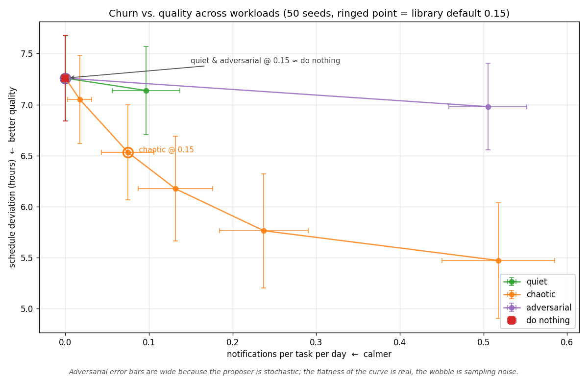

# stable-scheduler

A scheduling library that optimizes for **stability**, not just optimality.

Most schedulers recompute on every event and surface the locally optimal arrangement immediately. From the user's perspective this looks like chaos. `stable-scheduler` adds the term most planning systems leave out: a penalty for moving recently-placed tasks. Combined with recomputation windows, move thresholds, freeze horizons, and an authority hierarchy, the scheduler resists churn the user would experience as untrustworthy.

> A scoring function that does not include the cost of change is an incomplete objective function.

The companion article: [Why Optimal Scheduling Breaks User Trust](https://arjona.dev/writing/optimal-scheduling).

## Why this exists

In a previous role I shipped a "provably optimal" scheduler that nobody used. Within two weeks every engineer had pinned their tasks manually. The algorithm was correct. The product was broken. The fix was a 5-line change to the scoring function plus four production patterns layered on top. This library is the smallest reusable version of that fix.

## Install

```bash
pip install stable-scheduler
```

(Pre-1.0. API may change. Pin to a version.)

## Quick start

```python
from datetime import datetime, timedelta
from stable_scheduler import Authority, Proposal, Scheduler, Slot, Task, World

now = datetime.now()

task = Task(
    id="draft-q3-plan",
    priority=7,
    deadline=now + timedelta(hours=48),
    last_rescheduled_at=now - timedelta(minutes=15),
)

world = World(now=now)
scheduler = Scheduler(freeze_hours=2.0, move_threshold=0.15)

proposal = Proposal(
    task=task,
    proposed_slot=Slot(start=now + timedelta(hours=5), end=now + timedelta(hours=6)),
    authority=Authority.SERVER,
)

outcome = scheduler.evaluate(proposal, world)
if outcome.decision.value == "apply":
    world, task = scheduler.apply(proposal, world, now)
else:
    print(f"Rejected: {outcome.reason}")
```

## What's in the box

| Module      | What it does                                                                 |
|-------------|------------------------------------------------------------------------------|
| `score`     | Scoring function with the inverse-decay `reschedule_penalty` term most schedulers omit. |
| `threshold` | Move threshold gate. Marginal improvements are rejected; the default is 15%. |
| `freeze`    | Freeze horizon. Near-term tasks are immutable except for hard-deadline overrides. |
| `buffer`    | Recomputation window. Events are batched so the schedule changes at most once per window. |
| `authority` | Priority hierarchy. User pins beat deadline overrides beat the server beats the agent beats offline clients. |
| `scheduler` | Composes the above into a single decision pipeline.                          |

## The decision pipeline

```
proposal -> pin check -> authority check -> freeze check -> hard-deadline override -> threshold check -> apply
```

Every decision (apply or reject) carries a reason string. Wire `on_outcome` to log it — the lessons-learned section of the article is built on this telemetry.

```python
def log_outcome(outcome):
    print(f"{outcome.decision.value}: {outcome.reason}")

scheduler = Scheduler(on_outcome=log_outcome)
```

## Tuning

`STABILITY_WEIGHT` (in `ScoreWeights.stability`) is the parameter you will argue about more than any other. Start high (the default is 1.0). Track manual pin rates as a product health metric. When pin rates climb, the scheduler is churning too much and the weight is too low.

`move_threshold` controls how much improvement is needed to justify a move. 0.15 (15%) is a reasonable default for human-facing planning systems. Real-time dispatch systems may want lower (0.05). Calendars for knowledge workers may want higher (0.25).

`freeze_hours` is how far into the future is locked. 2.0 is the default. A real-time warehouse dispatcher might use 0.25. A weekly sprint planner might use 24.

## Empirical results

`examples/sim_pareto_workloads.py` sweeps `move_threshold` across three synthetic workloads (50 seeds each) and plots the resulting Pareto curve in `(notifications-per-task-per-day, schedule-deviation)` space. The deviation metric is mean absolute distance of `slot.end` from a reference "ideal end" of `deadline - 0.5h`, deliberately *not* derived from the scheduler's own scoring function so the metric isn't coupled to the gate it's evaluating.



Read this as a controlled toy, not a benchmark. What it shows:

- **The threshold mechanism works as advertised.** Higher threshold → fewer notifications, monotonically, across every workload.
- **The churn-versus-quality tradeoff is real on chaotic.** Each notification "buys" roughly 3.4 hours of better placement on average. Not a tautology: it could have been free or catastrophic. It's a moderate, roughly linear cost.
- **Workload shape changes the tradeoff.** The three curves are different species, not scaled versions of each other. There is no workload-independent "right" threshold because the exchange rate between notifications and quality depends on what the proposer is doing.

What it doesn't show:

- That `0.15` is a good default. It is defensible on chaotic, inert on quiet, and neither helps nor is meaningfully overcome by parameter tuning on adversarial. Which workload real users have isn't a question this experiment can answer.
- That the adversarial curve is flat *because of* the threshold. It's flat across the whole sweep including threshold zero — the proposer is producing updates the scheduler can't usefully act on. That's a scheduler-level finding, not a threshold-level one.

Run `python examples/sim_pareto_workloads.py` to regenerate. Companion article: [Why Optimal Scheduling Breaks User Trust](https://arjona.dev/writing/optimal-scheduling).

## What this library does *not* do

- Solve the underlying optimization. Bring your own scoring function or extend `score.compute_score`. This library is about the *stability terms* on top of whatever optimizer you use.
- Persist state. `World` is an in-memory snapshot. Bring your own database.
- Schedule jobs. This is not Celery or Cron. It decides whether a *proposed change* to an existing schedule should become user-visible.
- Handle distributed consensus. If multiple clients propose conflicting changes simultaneously, you need a coordination layer above this library.

## Tests

```bash
pip install -e ".[dev]"
pytest
```

## License

MIT
